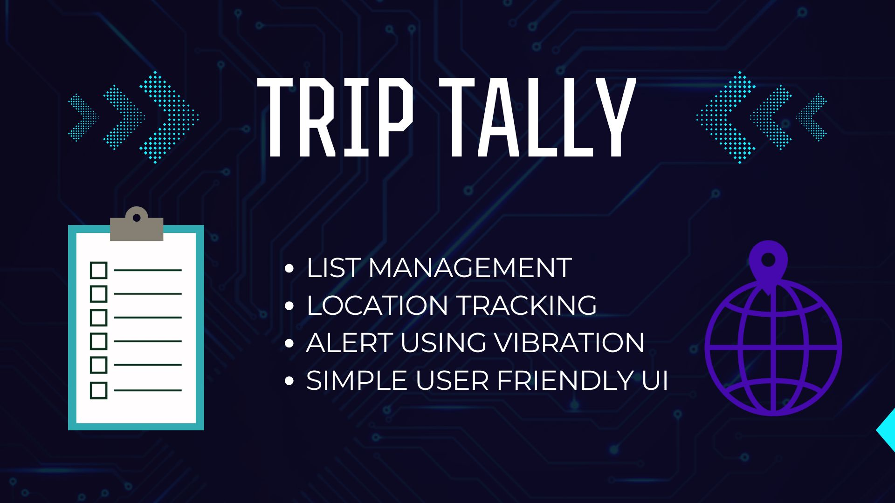
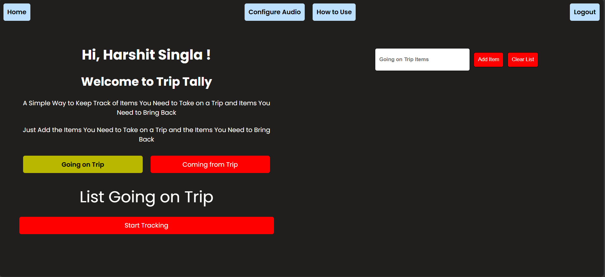

# TripTally

A sleek app to manage and track your travel essentials. Organize your packing lists, set reminders for must-buy items, and get alarms if you forget anything while on the go.



---

## Table of Contents

- [Key Features](#key-features)
- [Tech Stack](#tech-stack)
- [Project Structure](#project-structure)
- [Getting Started](#getting-started)
- [How It Works](#how-it-works)
- [Security](#security)
- [Screenshots](#screenshots)
- [Future Scope](#future-scope)
- [Contributing](#contributing)
- [License](#license)
- [Contact](#contact)

---

## Key Features

### Dual Packing Lists
Maintain separate lists for **Going on Trip** and **Coming from Trip**. Add, check off, and delete items with a single click. Your lists persist across sessions.

### Alarm & Reminder System
Forgot to pack something? TripTally plays an audio alarm when unchecked items remain on your active list. Configure the alarm volume, duration, and reminder interval to your preference.

### User Authentication
Sign up and log in to keep your data tied to your account. Passwords are **SHA-256 hashed** before storage, and sessions use **cryptographically random tokens** instead of predictable user IDs.

### Audio Configuration
Fine-tune your reminder experience:
- Adjust alarm volume (0-100%)
- Set alarm playback duration
- Set reminder check interval
- Test the alarm sound before your trip

### Responsive Design
Works on both desktop and mobile browsers with a clean, intuitive interface.

---

## Tech Stack

| Layer     | Technology                        |
|-----------|-----------------------------------|
| Frontend  | HTML5, CSS3, Vanilla JavaScript   |
| Backend   | Node.js, Express.js (static file server) |
| Storage   | Browser LocalStorage, Cookies     |
| Security  | Web Crypto API (SHA-256, `crypto.getRandomValues`) |

---

## Project Structure

```
TripTally/
├── index.js                          # Express server entry point
├── package.json
├── public/
│   ├── index.html                    # Main dashboard
│   ├── icon.png                      # App favicon
│   ├── Jhol.mp3                      # Alarm audio file
│   ├── pages/
│   │   ├── user.html                 # Login / Sign Up page
│   │   ├── reset.html                # Password reset page
│   │   ├── configure-audio.html      # Audio settings page
│   │   └── tutorial.html             # Tutorial / help page
│   ├── scripts/
│   │   ├── assets/                   # Core components & utilities
│   │   │   ├── hash.js               # SHA-256 hashing & session management
│   │   │   ├── item.js               # List item DOM component
│   │   │   ├── elemets.js            # HTML templates
│   │   │   ├── functions.js          # UI helper functions
│   │   │   └── audioFunctions.js     # Audio control logic
│   │   ├── auth/                     # Authentication
│   │   │   ├── auth.js               # Login / Sign Up handlers
│   │   │   ├── user.js               # User class definition
│   │   │   └── reset.js              # Password reset logic
│   │   ├── src/                      # Page initialization
│   │   │   ├── main.js               # Main app setup
│   │   │   └── configAudio.js        # Audio config page setup
│   │   └── utils/                    # Utilities
│   │       ├── data.js               # LocalStorage data management
│   │       ├── checkAuth.js          # Auth state verification
│   │       ├── tracking.js           # Reminder / alarm system
│   │       ├── location.js           # Geolocation functions
│   │       └── controls.js           # Location tracking controls
│   ├── styles/
│   │   ├── main/                     # Global & tutorial styles
│   │   ├── auth/                     # Auth page styles
│   │   └── components/               # Component-specific styles
│   └── tutorial/                     # Tutorial screenshots (1-10.png)
└── Readme/
    └── TripTally.jpg                 # Banner image
```

---

## Getting Started

### Prerequisites

- [Node.js](https://nodejs.org/) (v14 or later)
- npm (comes with Node.js)

### Installation

1. **Clone the repository**
   ```bash
   git clone https://github.com/harshit391/TripTally.git
   ```

2. **Navigate to the project directory**
   ```bash
   cd TripTally
   ```

3. **Install dependencies**
   ```bash
   npm install
   ```

4. **Start the server**
   ```bash
   npm start
   ```

5. **Open in your browser**
   ```
   http://localhost:3000
   ```

---

## How It Works

### Authentication Flow

```
Sign Up  -->  Hash password (SHA-256)  -->  Store user in localStorage
         -->  Generate random session token  -->  Set cookie  -->  Redirect to dashboard

Login    -->  Hash entered password  -->  Compare against stored hash
         -->  On match: create session token  -->  Set cookie  -->  Redirect to dashboard

Logout   -->  Clear session from localStorage  -->  Clear cookie  -->  Redirect to login
```

### Data Flow

```
User adds item  -->  Item saved to localStorage (per-user)  -->  DOM updated
Page loads      -->  Session token validated  -->  User data loaded  -->  Lists rendered
```

### Reminder System

1. User enables tracking on the dashboard
2. A periodic check runs at the configured reminder interval
3. If any unchecked items exist on the active list, the alarm audio plays
4. The alarm stops after the configured duration
5. The cycle repeats until all items are checked or tracking is disabled

---

## Security

- **Password Hashing** -- All passwords are hashed using SHA-256 via the Web Crypto API before being stored. Plain-text passwords are never persisted.
- **Secure Session Tokens** -- Sessions use 256-bit cryptographically random tokens generated with `crypto.getRandomValues()`, replacing the previous predictable user ID approach.
- **Session Management** -- Each login generates a unique session token stored in both a cookie and localStorage. Logout invalidates the token on both sides.
- **Legacy Migration** -- Existing accounts with plain-text passwords are automatically upgraded to hashed passwords on next login.
- **Password Strength** -- Minimum 6-character password requirement enforced on sign up and password reset.

> **Note:** This is a client-side application. All data (including hashed passwords and session tokens) is stored in the browser's localStorage. For production use, a server-side backend with a proper database would be recommended.

---

## Screenshots

<details>
<summary>Click to view screenshots</summary>

| | |
|---|---|
|  |  |
|  |  |
|  |  |
|  |  |
|  |  |

</details>

---

## Future Scope

- **Cloud Database** -- Sync data across devices so users can manage lists on desktop and access them on mobile
- **Location Tracking** -- Detect when a user arrives at or leaves a location and trigger reminders automatically
- **List Suggestions** -- Recommend packing items based on the trip destination and weather
- **Interactive Map** -- Show places left to visit on a GPS map
- **Collaborative Lists** -- Share packing lists with travel companions

---

## Contributing

Contributions are welcome! If you'd like to improve TripTally:

1. Fork the repository
2. Create a feature branch (`git checkout -b feature/your-feature`)
3. Commit your changes (`git commit -m "Add your feature"`)
4. Push to the branch (`git push origin feature/your-feature`)
5. Open a Pull Request

---

## License

This project is licensed under the [ISC License](https://opensource.org/licenses/ISC).

---

## Contact

**Harshit Singla** -- [LinkedIn](https://www.linkedin.com/in/harshitsingla1761/)

Feel free to reach out for feedback, questions, or collaboration.
