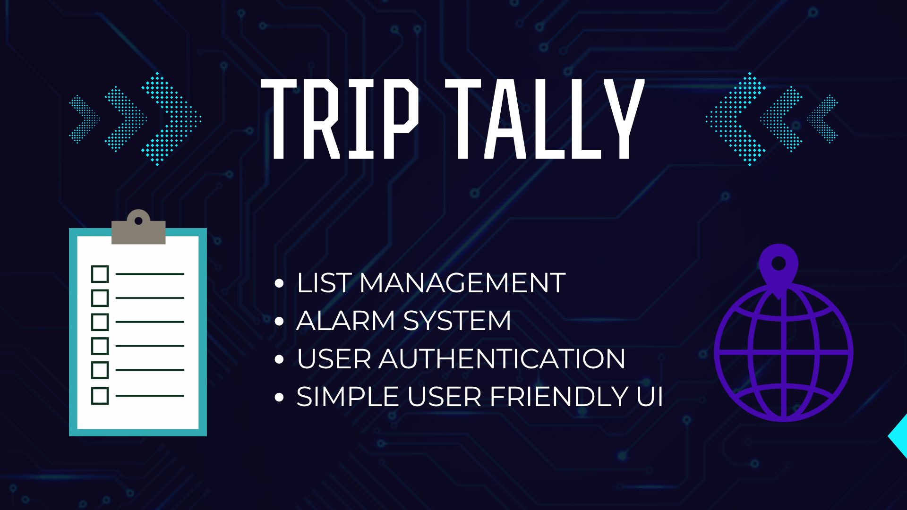

# TripTally
A sleek app to manage and track your travel essentials. Organize your packing lists, set reminders for must-buy items, and get real-time notifications if you forget anything while on the go.



---

### Index

1. [Key Feaures](#key-feaures)
2. [Pre-Requisites](#pre-requisites-for-using-this-app-as-an-developer-and-user)
3. [Tech Stack](#tech-stack)
4. [Data Base](#data-base)
5. [Setting up The Project in Your Local](#setting-up-the-project-in-your-local)
6. [Future Scope](#future-scope)
7. [Final Remarks](#final-remarks)

---

#### Key Feaures

* **Items List with Storage :-** Seperate Lists for Home and Trip Storing everything.
* **Alert System:-** If User forgot to Add Item Mentioned in the list, A Music will be Played as an Alarm.
- **User Interface :-** A User Friendly Interface with an Abstraction Layer so that User can easily maintain their List 

---

#### Pre-Requisites for Using This App as an Developer and User
- **For Both :-** An Internet Connection
* **For Developers :-** IDE is Required which can be Visual Stdio Code, Notepad++ or Anything.
- **For Users :-** If Anyone is using this App It will be required that The User should be honest with this app which means If He checking the item it means its already added and don't like He will add but checking the item earlier

---

#### Tech Stack
- HTML
- CSS
- Javascript
- Node and Express (Just for Live Server Purposes)

---

#### Data Base
- Local Web Storage
- Cookies

---

#### Setting up The Project in Your Local
- Clone The Repository
```bash
git clone https://github.com/harshit391/TripTally.git
```

- Enter the Directory
```bash
cd TripTally
```

- Run the Command npm install to install the dependencies
```bash
npm install
```

- Run the Project
```bash
npm start
```

- Open the Link in Your Browser - http://localhost:3000
```text
http://localhost:3000
```

---

#### Future Scope
- Improved User Interface
- Cloud Database for Both Desktop and Mobile Support :- User can add on Desktop and can access the same on Mobile
- Location Tracking System
- List Suggestions According to Destination
- Proper GPS Map Telling User this is the place Left To Visit

---

#### Final Remarks
- Feel free to Connect on LinkedIn for Any Feedback :- [LinkedIn :- Harshit Singla](https://www.linkedin.com/in/harshitsingla1761/)